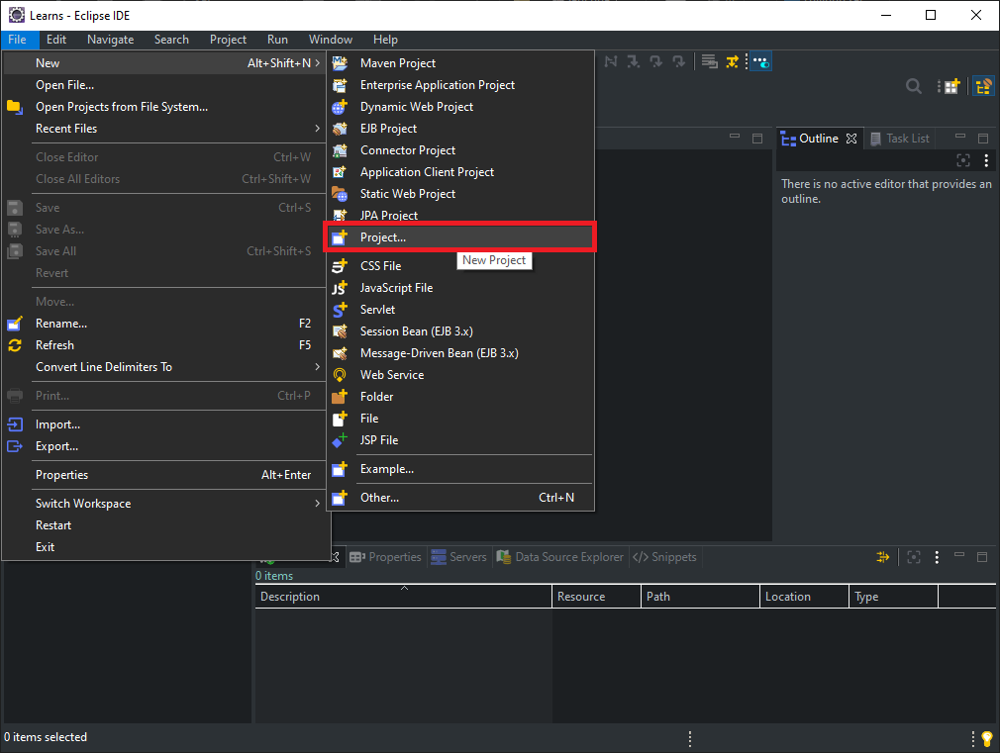
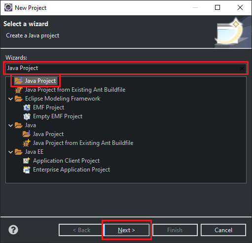
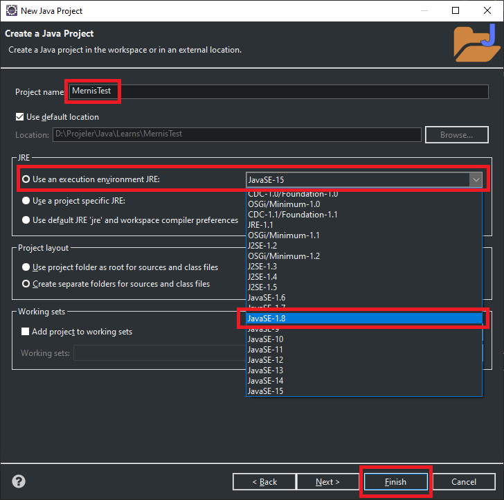
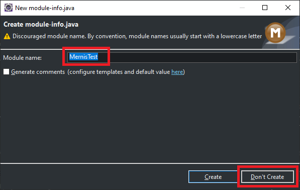
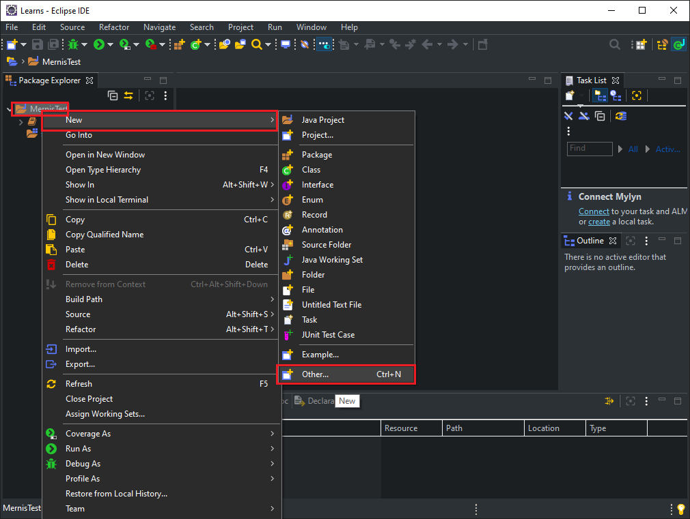
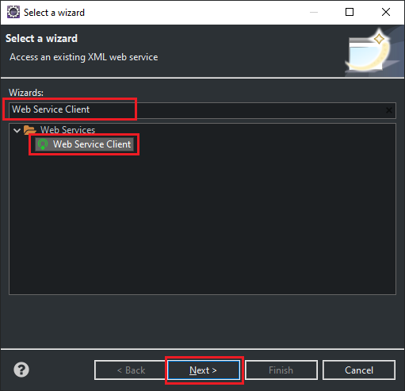
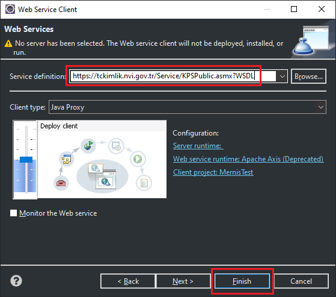
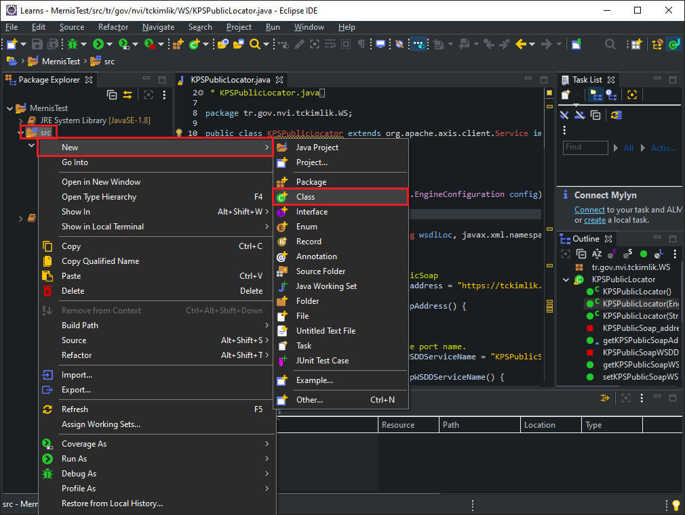
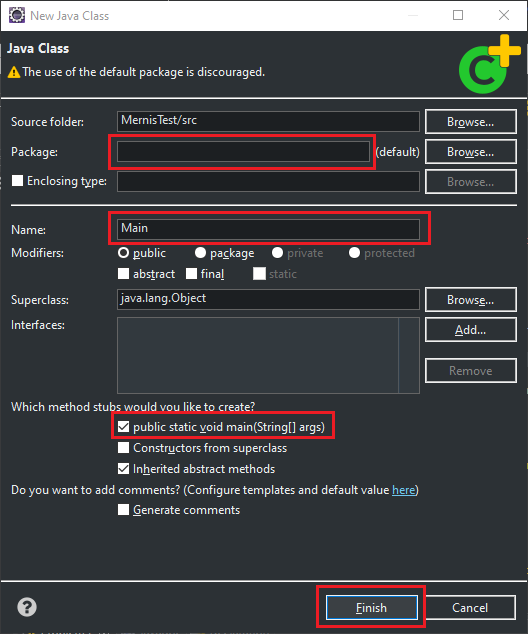
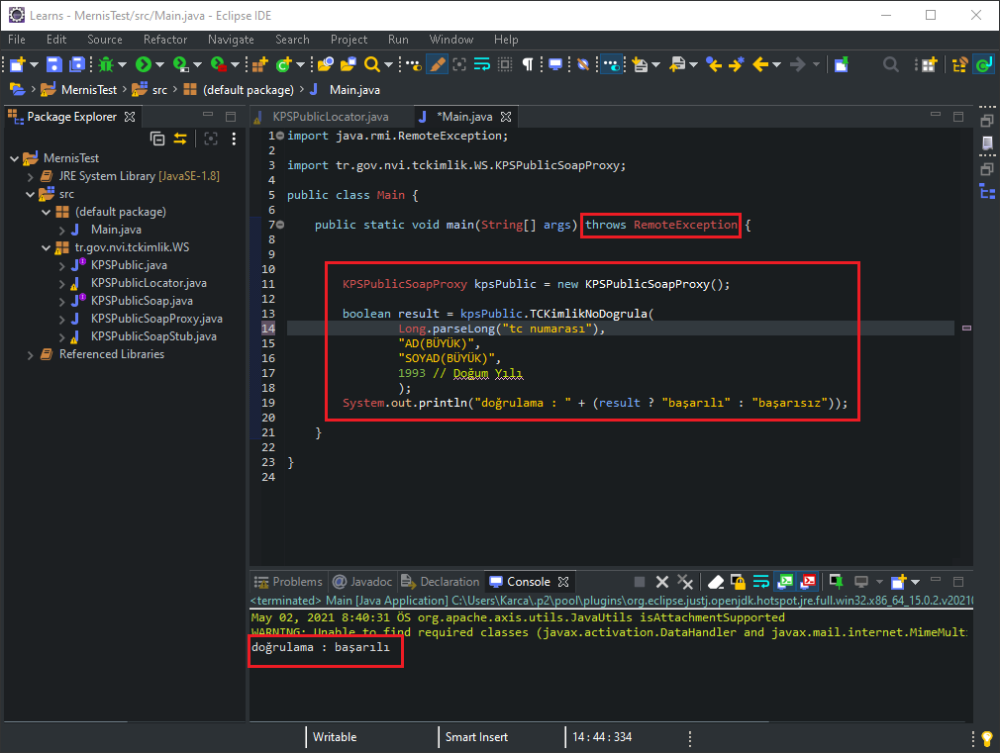

# MERNİS ( Kimlik Doğrulama Servisi ) Projeye Ekleme

### Üst menüden, "File - New - Project"

* * *

### Wizards: kısmında "Java Project" yazıp, alt taraftan "Java Project" yazanı seçip "Next" butonuna basıyoruz.

* * *

### Project name "MernisTest" olarak açıyorum, "Use an execution environment JRE:" kısmından JavaSE-1.8 seçiyoruz. (Mernis servisi için stabil sürüm) ve "Finish" diyoruz.

* * *

### Module name "MernisTest" olarak belirledim. "Don't Create" butonuna basıyorum ve projemi oluşturuyorum.

* * *

### Oluşan projeme sağ tıklayıp, "New - Other" seçiyorum.

* * *

### Wizards: kısmına "Web Service Client" yazıp, "Web Services altında ki Web Service Client" olanı seçiyorum ve "Next" butonuna basıyorum.

* * *

### Service definition: kısmına "https://tckimlik.nvi.gov.tr/Service/KPSPublic.asmx?WSDL" adresini yapıştırıyorum ve "Finish" butonuna basıyorum.

* * *

### Yine projemde "src" klasörüne sağ tıklayarak "New - Class" seçiyorum.

* * *

### Package: kısmını boş bırakıyorum, Name: kısmına "Main" yazıyorum, [ ] public static void main. yazan kısmı seçiyorum ve "Finish" butonuna basıyorum.

* * *

### Kırmızı çerçeveye aldığım her şeyi aynı şekilde yazarak projenizi mernis kimlik kontrolü ile birlikte çalıştırabilirsiniz.

